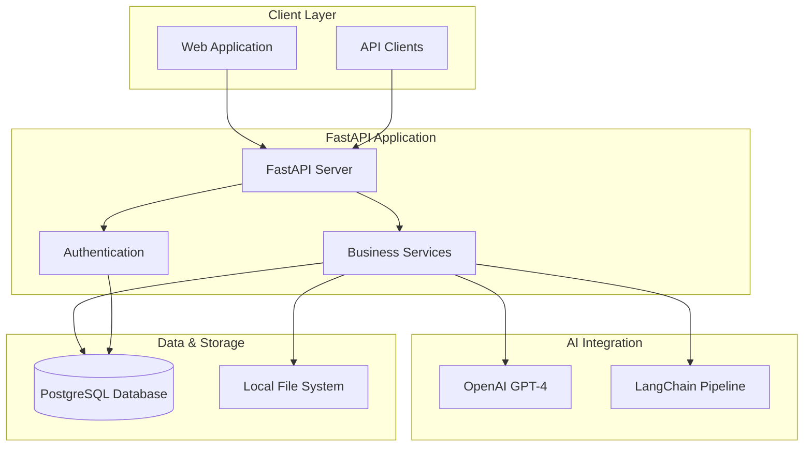
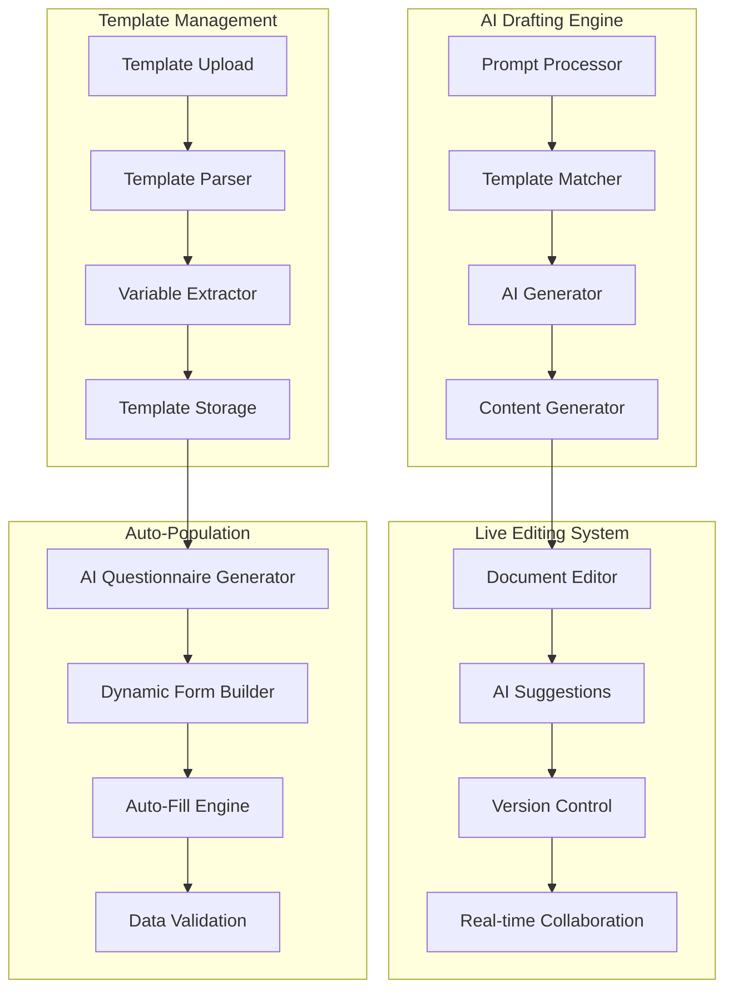
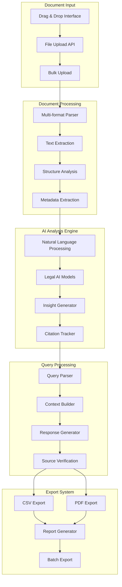
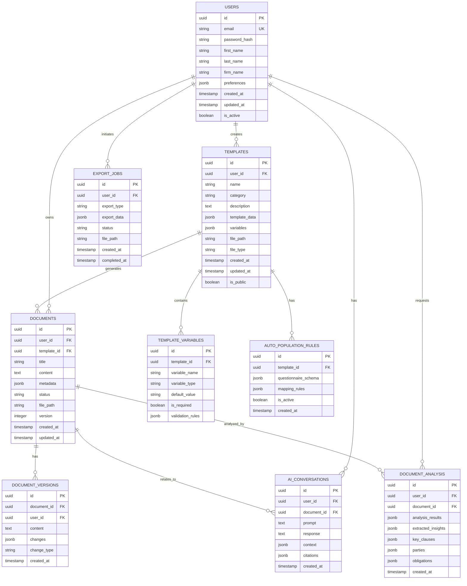
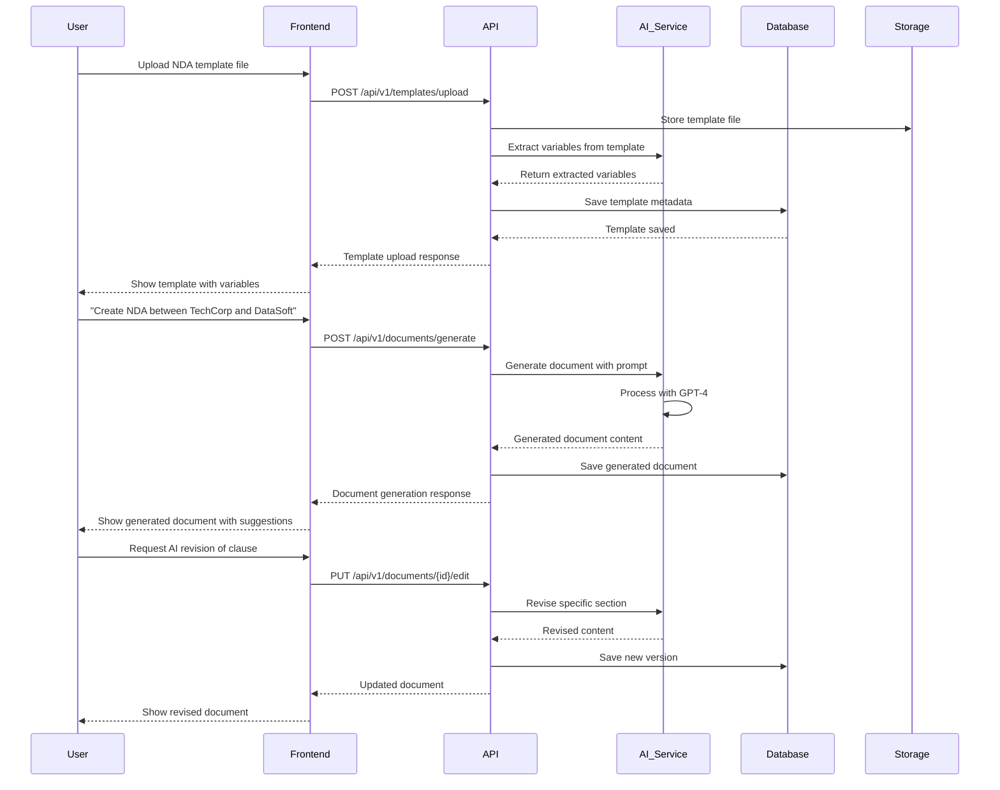
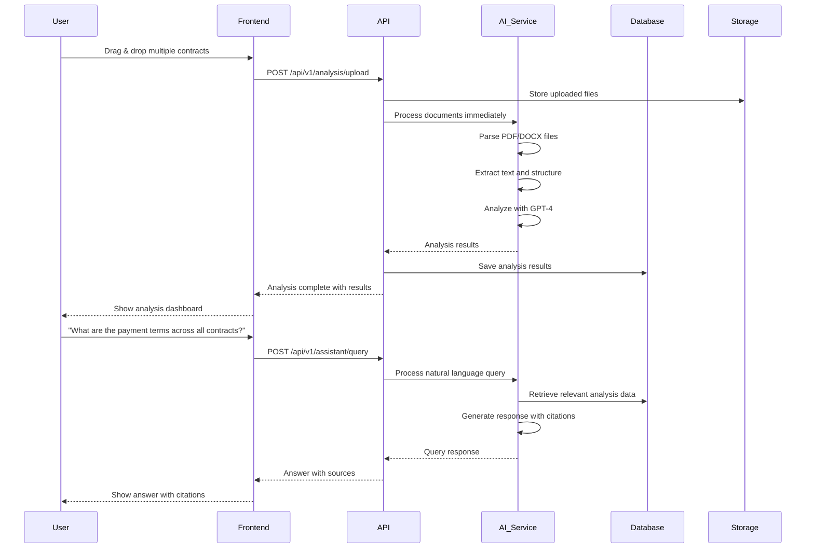

# Legal Product AI - Architecture & Implementation Overview

## Table of Contents

1. [System Overview](#system-overview)
2. [Architecture Diagrams](#architecture-diagrams)
3. [Database Schema](#database-schema)
4. [API Specifications](#api-specifications)
5. [Implementation Structure](#implementation-structure)
6. [Sample Interaction Flows](#sample-interaction-flows)

---

## System Overview

The Legal Product AI system is built using a modern Python-based microservices architecture designed to handle document automation and AI-powered legal assistance. The system consists of two main feature sets:

- **F1: Draft Automation Engine** - Template management, AI-powered document generation, live editing
- **F2: Personal AI Assistant** - Document analysis, natural language interaction, insight extraction

### Tech Stack

- **Backend**: FastAPI (Python 3.11+)
- **Database**: PostgreSQL 15+
- **AI Integration**: OpenAI GPT-4, LangChain
- **File Storage**: Local File System
- **Authentication**: JWT with FastAPI Security
- **Document Processing**: PyPDF2, python-docx, python-pptx

---

## Architecture Diagrams

### Simplified System Architecture



### F1: Draft Automation Engine Architecture



### F2: Personal AI Assistant Architecture



---

## Database Schema

### PostgreSQL Schema Design



---

## API Specifications

### Authentication APIs

```python
# POST /api/v1/auth/register
{
    "email": "lawyer@firm.com",
    "password": "secure_password",
    "first_name": "John",
    "last_name": "Doe",
    "firm_name": "Doe & Associates"
}

# POST /api/v1/auth/login
{
    "email": "lawyer@firm.com",
    "password": "secure_password"
}

# Response
{
    "access_token": "jwt_token_here",
    "token_type": "bearer",
    "expires_in": 3600,
    "user": {
        "id": "uuid",
        "email": "lawyer@firm.com",
        "first_name": "John",
        "last_name": "Doe",
        "firm_name": "Doe & Associates"
    }
}
```

### F1: Draft Automation Engine APIs

#### Template Management

```python
# POST /api/v1/templates/upload
# Content-Type: multipart/form-data
{
    "file": "template.docx",
    "name": "NDA Template",
    "category": "contracts",
    "description": "Standard Non-Disclosure Agreement"
}

# Response
{
    "id": "template_uuid",
    "name": "NDA Template",
    "category": "contracts",
    "variables": [
        {
            "name": "company_name",
            "type": "string",
            "required": true,
            "description": "Name of the company"
        },
        {
            "name": "effective_date",
            "type": "date",
            "required": true,
            "description": "Agreement effective date"
        }
    ],
    "created_at": "2025-01-01T00:00:00Z"
}

# GET /api/v1/templates
# Response
{
    "templates": [
        {
            "id": "uuid",
            "name": "NDA Template",
            "category": "contracts",
            "created_at": "2025-01-01T00:00:00Z",
            "variables_count": 5
        }
    ],
    "total": 1,
    "page": 1,
    "per_page": 20
}
```

#### AI Document Generation

```python
# POST /api/v1/documents/generate
{
    "prompt": "Create an NDA between TechCorp and DataSoft for a software development project",
    "template_id": "template_uuid",  # Optional
    "context": {
        "document_type": "NDA",
        "parties": ["TechCorp", "DataSoft"],
        "purpose": "software development collaboration"
    }
}

# Response
{
    "document_id": "doc_uuid",
    "title": "NDA - TechCorp & DataSoft",
    "content": "Generated document content...",
    "status": "draft",
    "template_used": "template_uuid",
    "ai_confidence": 0.95,
    "suggestions": [
        {
            "type": "clause_addition",
            "description": "Consider adding intellectual property clause",
            "position": 150
        }
    ]
}
```

#### Live Editing

```python
# PUT /api/v1/documents/{document_id}/edit
{
    "action": "ai_revise",
    "selection": {
        "start": 100,
        "end": 200
    },
    "instruction": "Make this clause more specific about data protection"
}

# Response
{
    "document_id": "doc_uuid",
    "version": 2,
    "changes": [
        {
            "type": "revision",
            "start": 100,
            "end": 200,
            "old_content": "Original text...",
            "new_content": "Revised text with specific data protection terms...",
            "ai_explanation": "Added specific GDPR compliance requirements"
        }
    ],
    "updated_content": "Full updated document content..."
}
```

#### Auto-Population

```python
# POST /api/v1/templates/{template_id}/questionnaire
# Response
{
    "questionnaire_id": "quest_uuid",
    "questions": [
        {
            "id": "q1",
            "question": "What is the name of the first party?",
            "type": "text",
            "variable": "party_1_name",
            "required": true
        },
        {
            "id": "q2",
            "question": "What is the effective date of this agreement?",
            "type": "date",
            "variable": "effective_date",
            "required": true
        }
    ]
}

# POST /api/v1/documents/auto-populate
{
    "template_id": "template_uuid",
    "questionnaire_id": "quest_uuid",
    "answers": {
        "q1": "TechCorp Inc.",
        "q2": "2025-02-01"
    }
}

# Response
{
    "document_id": "doc_uuid",
    "title": "Auto-populated NDA - TechCorp Inc.",
    "content": "Populated document content...",
    "populated_variables": {
        "party_1_name": "TechCorp Inc.",
        "effective_date": "February 1, 2025"
    }
}
```

### F2: Personal AI Assistant APIs

#### Document Analysis

```python
# POST /api/v1/analysis/upload
# Content-Type: multipart/form-data
{
    "files": ["contract1.pdf", "contract2.docx"],
    "analysis_type": "comprehensive"
}

# Response (Immediate processing)
{
    "analysis_id": "analysis_uuid",
    "status": "completed",
    "results": [
        {
            "document_id": "doc1_uuid",
            "filename": "contract1.pdf",
            "analysis": {
                "document_type": "Service Agreement",
                "parties": [
                    {
                        "name": "ABC Corp",
                        "role": "Service Provider"
                    },
                    {
                        "name": "XYZ Ltd",
                        "role": "Client"
                    }
                ],
                "key_clauses": [
                    {
                        "type": "payment_terms",
                        "content": "Payment due within 30 days...",
                        "page": 2,
                        "confidence": 0.98
                    }
                ],
                "obligations": [
                    {
                        "party": "ABC Corp",
                        "obligation": "Deliver services by March 1, 2025",
                        "deadline": "2025-03-01"
                    }
                ],
                "risks": [
                    {
                        "type": "liability",
                        "description": "Unlimited liability clause present",
                        "severity": "high"
                    }
                ]
            }
        }
    ]
}

# GET /api/v1/analysis/{analysis_id}
# Response
{
    "analysis_id": "analysis_uuid",
    "status": "completed",
    "created_at": "2025-01-01T00:00:00Z",
    "results": [
        {
            "document_id": "doc1_uuid",
            "filename": "contract1.pdf",
            "analysis": {
                "document_type": "Service Agreement",
                "parties": [...],
                "key_clauses": [...],
                "obligations": [...],
                "risks": [...]
            }
        }
    ]
}
```

#### Natural Language Queries

```python
# POST /api/v1/assistant/query
{
    "query": "What are the payment terms in all uploaded contracts?",
    "document_ids": ["doc1_uuid", "doc2_uuid"],
    "context": {
        "focus": "payment_terms",
        "include_citations": true
    }
}

# Response
{
    "query_id": "query_uuid",
    "response": "Based on the analyzed contracts, here are the payment terms:\n\n1. Contract ABC-XYZ: Payment due within 30 days of invoice date\n2. Contract DEF-GHI: Payment due within 45 days with 2% early payment discount\n\nBoth contracts include late payment penalties of 1.5% per month.",
    "citations": [
        {
            "document_id": "doc1_uuid",
            "document_name": "contract1.pdf",
            "page": 2,
            "section": "Payment Terms",
            "text": "Payment due within 30 days of invoice date"
        }
    ],
    "confidence": 0.94,
    "related_queries": [
        "What are the late payment penalties?",
        "Are there any early payment discounts?"
    ]
}
```

#### Export Services

```python
# POST /api/v1/exports/create
{
    "export_type": "csv",
    "data_source": "analysis_results",
    "document_ids": ["doc1_uuid", "doc2_uuid"],
    "fields": [
        "document_name",
        "parties",
        "payment_terms",
        "key_dates",
        "obligations"
    ],
    "format_options": {
        "include_headers": true,
        "delimiter": ","
    }
}

# Response
{
    "export_id": "export_uuid",
    "status": "processing",
    "estimated_completion": "2025-01-01T00:05:00Z"
}

# GET /api/v1/exports/{export_id}/download
# Returns file download with appropriate headers
```

---

## Implementation Structure

### Simplified FastAPI Application Structure

```
legal_ai/
├── app/
│   ├── __init__.py
│   ├── main.py                 # FastAPI app initialization
│   ├── config.py              # Configuration settings
│   ├── database.py            # Database connection
│   ├── dependencies.py        # Common dependencies
│   │
│   ├── models/                # SQLAlchemy models
│   │   ├── __init__.py
│   │   ├── user.py
│   │   ├── template.py
│   │   ├── document.py
│   │   ├── analysis.py
│   │   └── conversation.py
│   │
│   ├── schemas/               # Pydantic schemas
│   │   ├── __init__.py
│   │   ├── user.py
│   │   ├── template.py
│   │   ├── document.py
│   │   ├── analysis.py
│   │   └── assistant.py
│   │
│   ├── routers/               # API route handlers
│   │   ├── __init__.py
│   │   ├── auth.py
│   │   ├── templates.py
│   │   ├── documents.py
│   │   ├── analysis.py
│   │   ├── assistant.py
│   │   └── exports.py
│   │
│   ├── services/              # Business logic
│   │   ├── __init__.py
│   │   ├── auth_service.py
│   │   ├── template_service.py
│   │   ├── document_service.py
│   │   ├── ai_service.py
│   │   ├── analysis_service.py
│   │   └── export_service.py
│   │
│   ├── ai/                    # AI integration
│   │   ├── __init__.py
│   │   ├── openai_client.py
│   │   ├── langchain_pipeline.py
│   │   ├── document_processor.py
│   │   ├── template_analyzer.py
│   │   └── legal_ai.py
│   │
│   └── utils/                 # Utility functions
│       ├── __init__.py
│       ├── file_handler.py
│       ├── document_parser.py
│       ├── security.py
│       └── validators.py
│
├── migrations/                # Alembic migrations
├── tests/                     # Test files
├── uploads/                   # Local file storage
├── requirements.txt
└── README.md
```

### Key Implementation Files

#### main.py

```python
from fastapi import FastAPI, Middleware
from fastapi.middleware.cors import CORSMiddleware
from app.routers import auth, templates, documents, analysis, assistant, exports
from app.database import engine
from app.models import Base

# Create database tables
Base.metadata.create_all(bind=engine)

app = FastAPI(
    title="Legal Product AI",
    description="AI-powered legal document automation and analysis",
    version="1.0.0"
)

app.add_middleware(
    CORSMiddleware,
    allow_origins=["*"],
    allow_credentials=True,
    allow_methods=["*"],
    allow_headers=["*"],
)

# Include routers
app.include_router(auth.router, prefix="/api/v1/auth", tags=["authentication"])
app.include_router(templates.router, prefix="/api/v1/templates", tags=["templates"])
app.include_router(documents.router, prefix="/api/v1/documents", tags=["documents"])
app.include_router(analysis.router, prefix="/api/v1/analysis", tags=["analysis"])
app.include_router(assistant.router, prefix="/api/v1/assistant", tags=["assistant"])
app.include_router(exports.router, prefix="/api/v1/exports", tags=["exports"])
```

#### AI Service Integration

```python
# app/ai/legal_ai.py
from openai import AsyncOpenAI
from langchain.text_splitter import RecursiveCharacterTextSplitter
from langchain.embeddings import OpenAIEmbeddings
from typing import List, Dict, Any

class LegalAI:
    def __init__(self):
        self.client = AsyncOpenAI()
        self.embeddings = OpenAIEmbeddings()
        self.text_splitter = RecursiveCharacterTextSplitter(
            chunk_size=1000,
            chunk_overlap=200
        )

    async def generate_document(
        self,
        prompt: str,
        template_content: str = None,
        context: Dict[str, Any] = None
    ) -> Dict[str, Any]:
        """Generate legal document based on prompt and template"""

        system_prompt = """You are a legal AI assistant specialized in drafting legal documents.
        Generate accurate, professional legal content based on the user's requirements."""

        messages = [
            {"role": "system", "content": system_prompt},
            {"role": "user", "content": f"Generate a legal document: {prompt}"}
        ]

        if template_content:
            messages.append({
                "role": "user",
                "content": f"Use this template as reference: {template_content}"
            })

        response = await self.client.chat.completions.create(
            model="gpt-4",
            messages=messages,
            temperature=0.3
        )

        return {
            "content": response.choices[0].message.content,
            "confidence": 0.95,  # Calculate based on response
            "suggestions": await self._generate_suggestions(response.choices[0].message.content)
        }

    async def analyze_document(self, content: str) -> Dict[str, Any]:
        """Analyze legal document and extract insights"""

        analysis_prompt = """Analyze this legal document and extract:
        1. Document type
        2. Parties involved
        3. Key clauses and terms
        4. Important dates and deadlines
        5. Obligations for each party
        6. Potential risks or issues

        Provide structured output with citations."""

        response = await self.client.chat.completions.create(
            model="gpt-4",
            messages=[
                {"role": "system", "content": "You are a legal document analyzer."},
                {"role": "user", "content": f"{analysis_prompt}\n\nDocument:\n{content}"}
            ],
            temperature=0.1
        )

        return await self._parse_analysis_response(response.choices[0].message.content)
```

---

## Sample Interaction Flows

### Flow 1: Template Upload & AI Document Generation



**API Call Examples:**

```bash
# 1. Upload Template
curl -X POST "http://localhost:8000/api/v1/templates/upload" \
  -H "Authorization: Bearer jwt_token" \
  -F "file=@nda_template.docx" \
  -F "name=Standard NDA Template" \
  -F "category=contracts"

# 2. Generate Document
curl -X POST "http://localhost:8000/api/v1/documents/generate" \
  -H "Authorization: Bearer jwt_token" \
  -H "Content-Type: application/json" \
  -d '{
    "prompt": "Create an NDA between TechCorp and DataSoft for software development collaboration",
    "template_id": "template_uuid_here"
  }'

# 3. AI Revision
curl -X PUT "http://localhost:8000/api/v1/documents/doc_uuid/edit" \
  -H "Authorization: Bearer jwt_token" \
  -H "Content-Type: application/json" \
  -d '{
    "action": "ai_revise",
    "selection": {"start": 150, "end": 300},
    "instruction": "Make the confidentiality clause more specific"
  }'
```

### Flow 2: Document Analysis & Insight Extraction



**API Call Examples:**

```bash
# 1. Upload Documents for Analysis (Immediate processing)
curl -X POST "http://localhost:8000/api/v1/analysis/upload" \
  -H "Authorization: Bearer jwt_token" \
  -F "files=@contract1.pdf" \
  -F "files=@contract2.docx" \
  -F "analysis_type=comprehensive"

# 2. Get Analysis Results
curl -X GET "http://localhost:8000/api/v1/analysis/analysis_uuid" \
  -H "Authorization: Bearer jwt_token"

# 3. Natural Language Query
curl -X POST "http://localhost:8000/api/v1/assistant/query" \
  -H "Authorization: Bearer jwt_token" \
  -H "Content-Type: application/json" \
  -d '{
    "query": "What are the payment terms in all uploaded contracts?",
    "document_ids": ["doc1_uuid", "doc2_uuid"],
    "context": {"include_citations": true}
  }'
```

### Flow 3: Auto-Population Workflow

```mermaid
sequenceDiagram
    participant User
    participant Frontend
    participant API
    participant AI_Service
    participant Database

    User->>Frontend: Select template for auto-population
    Frontend->>API: POST /api/v1/templates/{id}/questionnaire
    API->>AI_Service: Generate smart questionnaire
    AI_Service->>AI_Service: Analyze template variables
    AI_Service->>AI_Service: Create contextual questions
    AI_Service-->>API: Generated questionnaire
    API->>Database: Save questionnaire
    API-->>Frontend: Questionnaire response
    Frontend-->>User: Show dynamic form

    User->>Frontend: Fill out questionnaire form
    Frontend->>API: POST /api/v1/documents/auto-populate
    API->>AI_Service: Process answers and populate template
    AI_Service->>AI_Service: Map answers to variables
    AI_Service->>AI_Service: Generate populated document
    AI_Service-->>API: Populated document
    API->>Database: Save populated document
    API-->>Frontend: Document ready
    Frontend-->>User: Show populated document

    User->>Frontend: Request export to PDF
    Frontend->>API: POST /api/v1/exports/create
    API->>AI_Service: Generate export with formatting
    AI_Service-->>API: Export ready
    API-->>Frontend: Export download link
    Frontend-->>User: Download populated document
